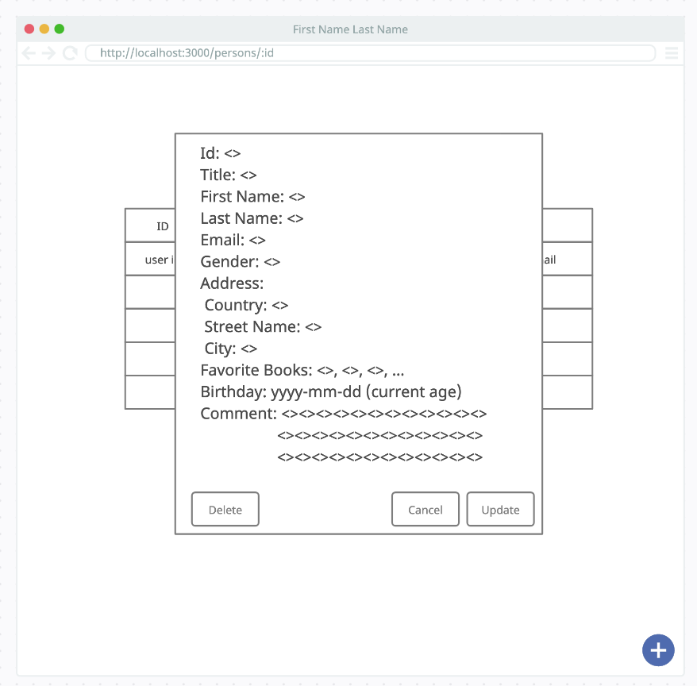
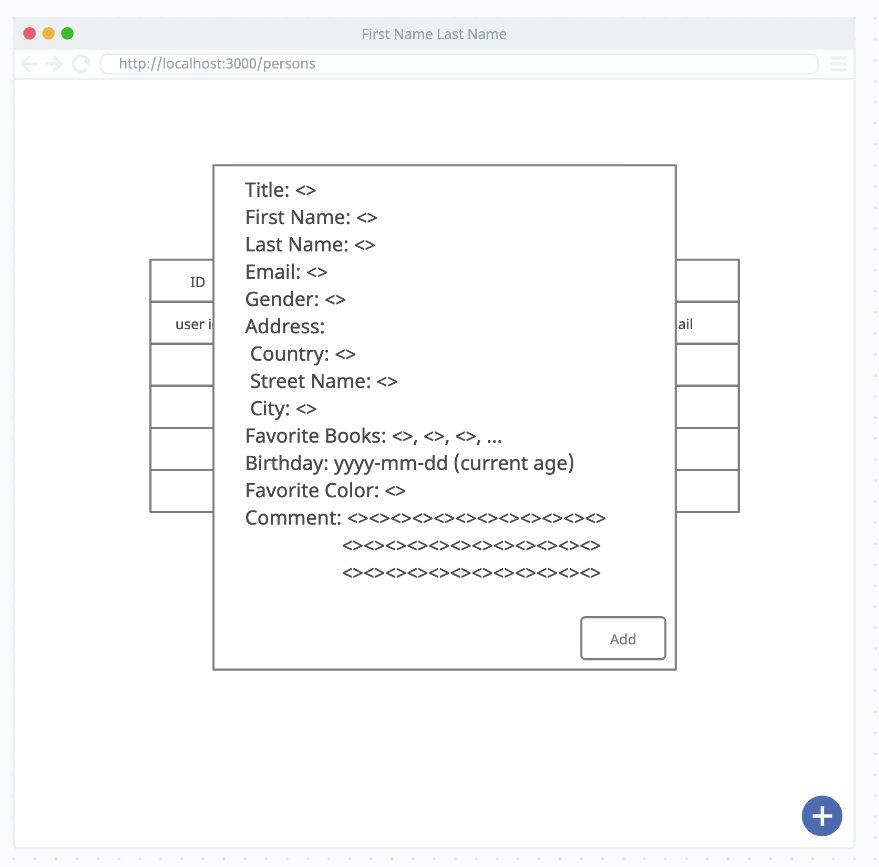

# Frontend interview challenge

Welcome to our frontend challenge! Before we describe the challenge in depth, we would like to foremost go through what we expect of you while you undertake our challenge and what you need to know beforehand

## What we expect from you

- Does your codebase follow the requirements stated in this document (including following the given wireframes)?
- Is your code correctly formatted and easy to understand?
- Is your git history pretty? (We expect commits with descriptive messages)
- Does your application not contain any obvious bugs?

## Before you get started

- Make sure you clone this repository
- Make sure you install dependencies for this challenge (by typing `yarn`)
- In regards to dependencies:
  - You must not remove already installed dependencies present in the `package.json` file
  - You many install any dependency you like for this challenge, including any component libraries
- Please do not change any files within the `src/mocks` folder. This is where your backend is mocked, however, do feel free to take a look though!

## Challenge

Create a React application with the following views and functionality:

### `List View`

This view should be the first thing present when your application has successfully loaded. A table with four columns (ID, Title, Name and Email) should be shown, like the following wireframe below. The data required for this table will be present in our mocked backend. For more details about our mocked backend, take a look at the `Available endpoints` section.


In addition to rendering the table, we also expect the following:
- Should show loading indication while loading data
- Should show error message if data could not be loaded
- Should be paginated

### `Details Modal`

This modal should be displayed whenever a row in the table is clicked. The modal should show more information about the person, like the following wireframe below. A user should also be to edit _firstName_, _lastName_, _birthday_ and _comment_ through the endpoint and should also be able to delete the person. To reiterate, this data is available from our mocked backend, as shown in the `Available endpoints` section.



In addition to showing the modal, we also expect the following:
- Should show loading indication while loading data
- Should show error message if data could not be loaded
- Should show loading indication while updating data
- Should show error indication if updating data fails
- Should show success indication if updating data succeeds
- Background color of the modal should be the same as the person's favorite color (this is given from the mocked backend)

### `Add Modal`

This modal should be displayed whenever we click on the plus button present in the bottom far-right of the wireframe. The user will then need to add the following information about the person they would like to add. In addition, the user should be able to add more than one favorite book about the person they would like to add if they wish. Lastly, all fields in the modal below besides the `Comment` field are required when adding a person.



In addition to presenting the modal, we also expect the following:
- Should show loading indication while adding/saving the person
- Should show error indication if adding data fails
- Should show success indication if adding person succeeds
- Close modal when person has been successfully added

## Available endpoints

All endpoints below can be reached by sending requests to the localhost URL (available when you run your app locally).

For instance, if you start your development environment locally (by running the `yarn start` command) and the application is served through `http://localhost:3000`. 

You should be able to retrieve information about a particular person if you send a GET request to the following address: `http://localhost:3000/persons/:id`, example: `http://localhost:3000/persons/6ad313a7d001e`

All endpoints has the following response body whenever an error has occurred:

```js
{
  errors: ["<Error message>"]
}
```

- ### `GET` "/persons?page=number"

  To retrieve a paged list of people in the mocked backend

  Returns a `200` response with the following response body:

  ```js
  {
    results: [
      {
        id: string,
        firstName: string,
        lastName: string,
        email: string,
        title: string
      },
    ],
    hasNextPage: boolean
  }
  ```

- ### `GET` "/persons/:id"

  To retrieve a particular person in the mocked backend

  Returns a `200` response with the following response body.

  Example response body:

  ```js
  {
    "id": "6ad313a7d001e",
    "firstName": "Skippy",
    "lastName": "Dunkerley",
    "favoriteBooks": [
      "364186697-9",
      "475215020-4",
      "570912095-2",
      "640196807-9",
      "124026580-8"
    ],
    "email": "sdunkerley0@unblog.fr",
    "gender": "Male",
    "address": {
      "country": "Portugal",
      "streetName": "Russell",
      "postalCode": "4910-597",
      "city": "Vilarelho"
    },
    "title": "Honorable",
    "favoriteColor": "#864f45",
    "birthday": "2013-04-25",
    "comment": ""
  }
  ```

- ### `POST` "/persons"

  To create a person in the mocked backend

  Require the following request body:

  ```js
  {
    "id": string,
    "firstName": string,
    "lastName": string,
    "favoriteBooks": [string],
    "email": string,
    "gender": string,
    "address": {
      "country": string,
      "streetName": string,
      "postalCode": string,
      "city": string,
    },
    "title": string,
    "favoriteColor": string,
    "birthday": string,
    "comment": string // optional
  }
  ```

  Returns a `200` response with the following response body

  ```js
  {
    "id": string,
    "firstName": string,
    "lastName": string,
    "favoriteBooks": [string],
    "email": string,
    "gender": string,
    "address": {
      "country": string,
      "streetName": string,
      "postalCode": string,
      "city": string,
    },
    "title": string,
    "favoriteColor": string,
    "birthday": string,
    "comment": string // optional
  }
  ```

- ### `PATCH` "/persons/:id"

  To update a particular person in the mocked backend

  Require a request body with at least one of the following keys:

  - firstName
  - lastName
  - birthday
  - comment

  Example:

  ```js
  {
    firstName: string
  }
  ```

  Returns a `200` response with the following response body:

  ```js
  {
    "id": string,
    "firstName": string,
    "lastName": string,
    "favoriteBooks": [string],
    "email": string,
    "gender": string,
    "address": {
      "country": string,
      "streetName": string,
      "postalCode": string,
      "city": string,
    },
    "title": string,
    "favoriteColor": string,
    "birthday": string,
    "comment": string // optional
  }
  ```

- ### `DELETE` "/persons/:id"

  Deletes a particular person in the mocked backed

  Returns a `204` response without a response body

## Available Scripts

In the project directory, you can run:

### `yarn start`

Runs the app in the development mode.\
Open [http://localhost:3000](http://localhost:3000) to view it in your browser.

The backend is mocked using MWS. The react app will be able to make successful API calls to the endpoints listed under `Available endpoints`

The page will reload when you make changes.\
You may also see any lint errors in the console.

### `yarn test`

Launches the test runner in the interactive watch mode.\
See the section about [running tests](https://facebook.github.io/create-react-app/docs/running-tests) for more information.
